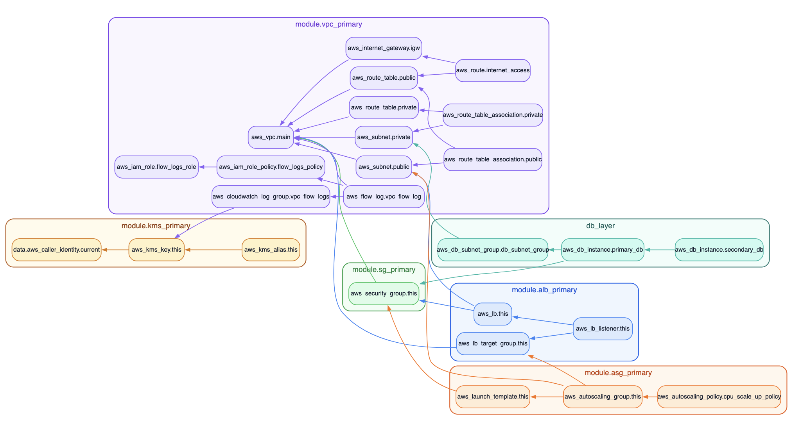

# DESF5 — Arquitetura AWS Multi-AZ com ALB, Auto Scaling e Banco em Sub-redes Privadas

## Visão geral

Este repositório apresenta a implementação da arquitetura proposta no desafio **DESF5**, com foco em alta disponibilidade, separação de camadas, segurança de rede e escalabilidade horizontal.  

A solução foi desenhada para operar na região **us-east-1**, distribuindo recursos em múltiplas zonas de disponibilidade para reduzir risco de indisponibilidade e melhorar resiliência operacional.

## Diagrama da arquitetura


## GaphWiz



## Descrição funcional da arquitetura

A entrada de tráfego parte dos usuários e segue para um **Application Load Balancer (ALB)** posicionado na camada pública da VPC. O ALB distribui requisições para instâncias de aplicação organizadas em **Auto Scaling Group**, também distribuídas entre múltiplas AZs.  

A camada de dados foi posicionada em sub-redes privadas, dentro de um **DB Subnet Group**, mantendo isolamento da internet e restringindo acesso somente aos componentes autorizados pela política de segurança.

O banco de dados foi modelado com os papéis **M**, **S** e **R**, em que **M** representa o nó principal (Master), **S** representa o nó de standby para continuidade operacional em cenário de falha de AZ (Multi-AZ), e **R** representa o nó de réplica para leitura. Esse desenho combina continuidade de serviço, capacidade de leitura distribuída e menor exposição de recursos críticos.

## Camadas e responsabilidades

| Camada | Componentes principais | Responsabilidade |
|---|---|---|
| Borda e acesso | Users & Accesses, ALB | Receber conexões externas e encaminhar tráfego de forma balanceada entre instâncias do AustoScaling (min=3, max=10, desired=3, CPU based 60%) |
| Aplicação | Auto Scaling Group em múltiplas AZs | Processar requisições com escala horizontal e tolerância a falhas |
| Dados | Master, Standby (Multi-AZ), Replica | Persistência transacional, continuidade de serviço e leitura replicada |
| Segurança e rede | VPC, Security Groups, sub-redes públicas e privadas | Segmentação de rede e controle de acesso entre camadas |

⚠️ Não há nenhum registro aqui sobre Network ACLs porque nada foi feito com relação às suas configurações padrão.

## Distribuição por zonas de disponibilidade

```
|    AZs     | Sub-rede pública | Sub-rede privada | Papel de destaque                 |
|------------|------------------|------------------|-----------------------------------|
| us-east-1a | public1          | private1         | Aplicação + nó Master             |
| us-east-1b | public2          | private2         | Aplicação + nó Standby (Multi-AZ) |
| us-east-1c | public3          | private3         | Aplicação + nó Replica            |
```

## Segurança aplicada no desenho

O desenho prioriza o princípio de menor privilégio, separando o que é público do que é privado e reduzindo superfície de ataque. O ALB recebe o tráfego externo e se comunica internamente com a camada de aplicação por regras explícitas de Security Group.  

A camada de banco permanece em sub-redes privadas, sem exposição direta à internet, aceitando conexões somente da camada de aplicação conforme regras de segurança definidas.

## Alta disponibilidade e continuidade

A distribuição em três AZs reduz impacto de falha localizada e permite continuidade operacional do serviço.  

Na camada de aplicação, o Auto Scaling Group mantém capacidade de reposição automática de instâncias.  

Na camada de dados, o modelo Multi-AZ com standby favorece recuperação rápida em eventos de indisponibilidade da zona primária, enquanto a réplica pode apoiar cenários de leitura e descarga de carga.

## Fluxo de tráfego em alto nível

O usuário acessa a aplicação pela borda da arquitetura, o ALB recebe e distribui o tráfego para a camada de aplicação, e a aplicação acessa a camada de dados privada para operações transacionais.  

A replicação interna entre os nós de dados mantém redundância e disponibilidade conforme o papel de cada instância no cluster.

## Infraestrutura como código

A arquitetura foi pensada para ser provisionada por IaC, garantindo consistência entre ambientes, versionamento de mudanças e rastreabilidade do ciclo de vida da infraestrutura.  

O fluxo recomendado contempla validação, planejamento e aplicação das mudanças.

```bash
terraform fmt -recursive
terraform init
terraform validate
terraform plan -out=tfplan
terraform apply tfplan
```

## Validação pós-provisionamento

Após o provisionamento, a validação deve confirmar que o ALB está ativo, que as instâncias da aplicação estão distribuídas entre AZs, que o banco está em sub-redes privadas e que os Security Groups permitem apenas os fluxos esperados entre camadas.

Também é recomendado executar testes de conectividade ponta a ponta, simular indisponibilidade de componente e observar o comportamento de failover e recuperação.

## Encerramento de ambiente

Quando necessário, a remoção controlada dos recursos pode ser feita pelo comando abaixo:

```bash
terraform destroy
```

## Custo Estimado da Infraestrutura

Este projeto foi analisado com Infracost, uma ferramenta que estima os custos da infraestrutura gerenciada via Terraform.

💰 Custo mensal estimado: aproximadamente USD $250.00

🧾 Esses valores podem variar conforme a região, tipo de instância e uso real

✅ Use o Infracost localmente com infracost breakdown --path=. para ver os detalhes

⚠️ Cuidado com Recursos Ativos

É ultra-necessário destruir todos os recursos após o uso com `terraform destroy` para evitar dor de cabeça.

Os recursos criados neste projeto podem gerar custos mesmo em estado "idle". Ideal para ambientes de teste, laboratório e aprendizado, mas sempre destrua quando terminar

## Conclusão

A arquitetura do desafio DESF5 foi estruturada para equilibrar desempenho, escalabilidade, segurança e resiliência, separando claramente camadas de acesso, aplicação e dados.
Com a combinação de ALB, Auto Scaling e banco em sub-redes privadas com estratégia Multi-AZ, o ambiente se mantém alinhado a boas práticas de produção em AWS.

